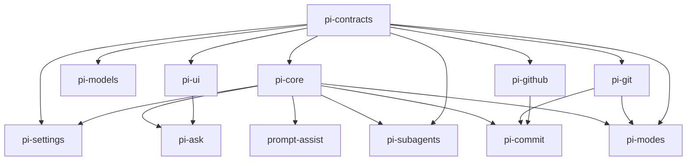
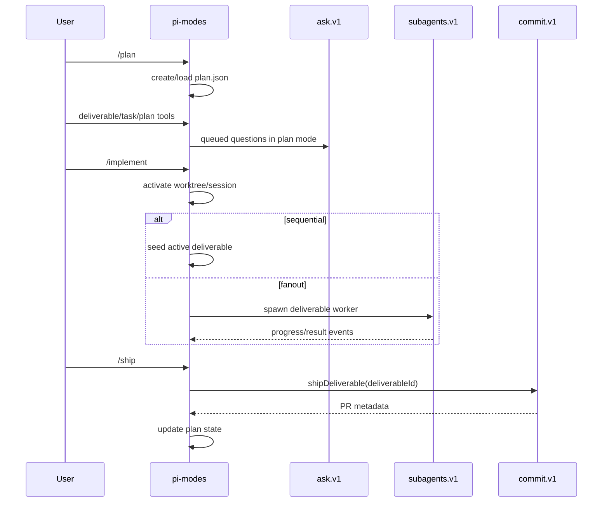

# Architecture

pi-maestro is a lockstep pi extension stack. The repo root is the pi bundle
manifest; packages under `packages/*` are either libraries or extensions.

## Package layers

Libraries are importable by any package:

- `@vegardx/pi-contracts`: shared ids, events, capability interfaces, run and
  plan vocabulary.
- `@vegardx/pi-core`: extension wrapper, capability registry, typed events,
  feature flags, and agent-turn helper.
- `@vegardx/pi-settings`: layered global/project settings reader and writer.
- `@vegardx/pi-models`: background-model resolution.
- `@vegardx/pi-ui`: pure renderers and thin TUI component wrappers.
- `@vegardx/pi-git`: typed git/worktree seam.
- `@vegardx/pi-github`: typed `gh`/GitHub seam.

Extensions are loaded by the root `pi.extensions` manifest and must not value
import one another:

- `@vegardx/pi-ask`: questionnaire capability and `ask` tool.
- `@vegardx/pi-prompt-assist`: ghost prompt suggestion tool and input assists.
- `@vegardx/pi-subagents`: run store, bus, profiles, runners, supervisor, and
  delegate tool.
- `@vegardx/pi-commit`: conventional commit generation plus commit/push/PR ship
  capability.
- `@vegardx/pi-modes`: permission modes, plan engine/tools, execution,
  worktrees, shipping, compaction, and UI state.

`scripts/check-boundaries.mjs` enforces the extension boundary.

## Runtime integration

Extensions communicate through versioned capabilities and typed events rather
than static imports.

Capabilities:

- `ask.v1`
- `prompt-assist.v1`
- `subagents.v1`
- `commit.v1`
- `modes.v1`

Events:

- `maestro.mode.changed`
- `maestro.plan.updated`
- `maestro.run.status`
- `maestro.run.progress`
- `maestro.supervisor.needDecision`
- `maestro.ship.completed`

Feature flags are resolved by `@vegardx/pi-core`:

1. Environment override (`PI_EXT_<NAME>`, `PI_DISABLE`, `PI_ENABLE`).
2. Project settings.
3. Global settings.
4. Default-on.

The kill switch wins. `scripts/check-feature-flags.mjs` verifies every extension
in the manifest is covered.

## Plan and execution flow

Persistent state lives under the pi agent directory:

- `maestro/plans/<slug>/plan.json`
- `maestro/runs/<repo>/<runId>/status.json`
- `maestro/runs/<repo>/<runId>/events.jsonl`
- `maestro/runs/<repo>/<runId>/result.md`

Plans are never garbage-collected automatically. Runs are pruned on
`session_start` by age/count/size policy, never while active.
