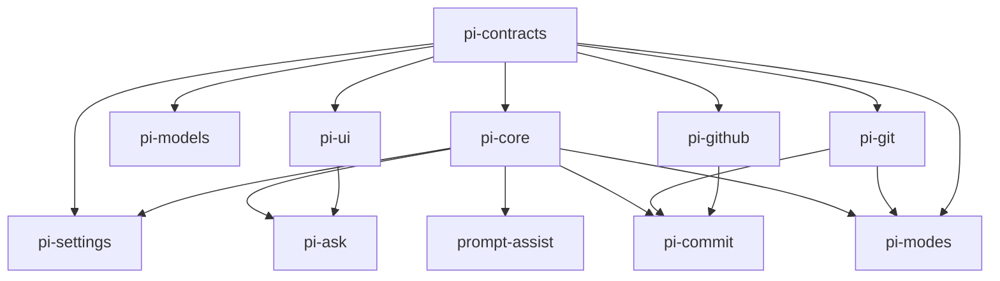
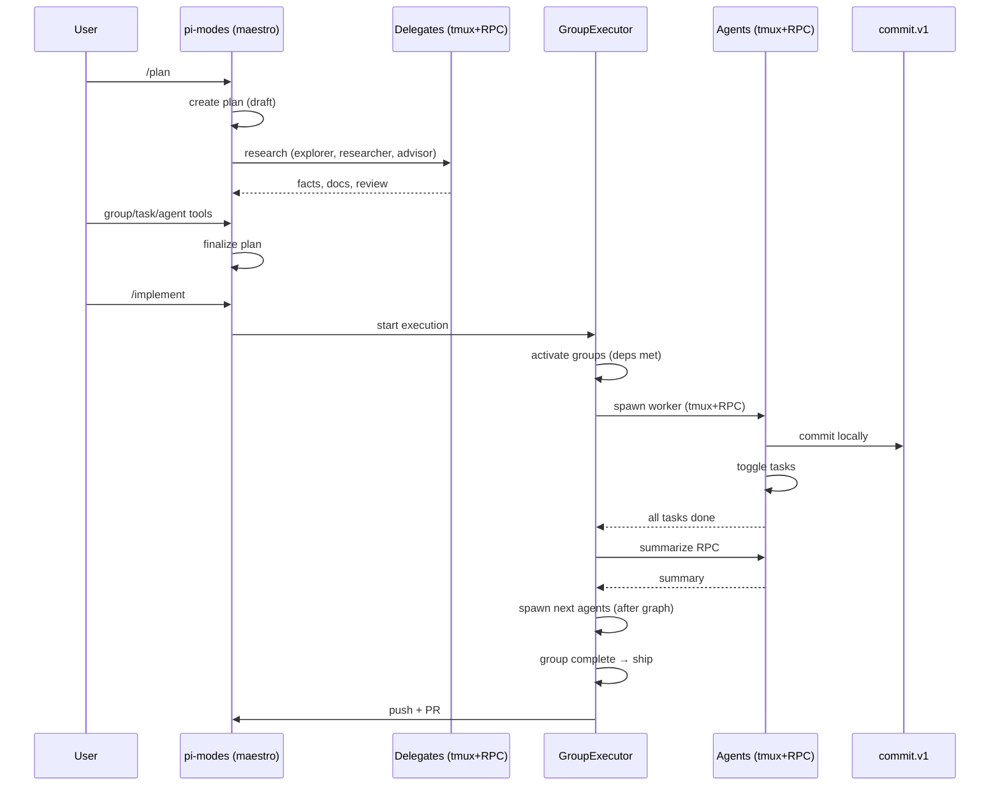

# Architecture

pi-maestro is a lockstep pi extension stack. The repo root is the pi bundle
manifest; packages under `packages/*` are either libraries or extensions.

## Package layers

Libraries are importable by any package:

- `@vegardx/pi-contracts`: shared ids, events, capability interfaces, plan vocabulary.
- `@vegardx/pi-core`: extension wrapper, capability registry, typed events, feature flags.
- `@vegardx/pi-settings`: layered global/project settings reader and writer.
- `@vegardx/pi-models`: preset-based model resolution, slot/effort mapping.
- `@vegardx/pi-ui`: pure renderers and thin TUI component wrappers.
- `@vegardx/pi-git`: typed git/worktree seam.
- `@vegardx/pi-github`: typed `gh`/GitHub seam.

Extensions are loaded by the root `pi.extensions` manifest and must not value
import one another:

- `@vegardx/pi-ask`: questionnaire capability and `ask` tool.
- `@vegardx/pi-prompt-assist`: ghost prompt suggestion tool and input assists.
- `@vegardx/pi-commit`: conventional commit generation + ship capability.
- `@vegardx/pi-modes`: permission modes, plan engine/tools, group execution,
  shipping, compaction, delegates, and UI state.

`scripts/check-boundaries.mjs` enforces the extension boundary.

## Runtime integration

Extensions communicate through versioned capabilities and typed events.

Capabilities:

- `ask.v1` — questionnaire presentation
- `prompt-assist.v1` — ghost text suggestions
- `commit.v1` — local conventional commits
- `ship.v1` — push + PR creation
- `modes.v1` — mode state + execution status
- `usage.v1` — unified token/cost ledger

Events:

- `maestro.mode.changed`
- `maestro.plan.updated`
- `maestro.run.status`
- `maestro.run.progress`
- `maestro.ship.completed`

## Plan and execution flow

Persistent state lives under the pi agent directory:

- `maestro/plans/<slug>/plan.json` — group-based plan
- Agent sessions managed via tmux (ephemeral)
- Usage recorded in unified ledger

Plans are never garbage-collected automatically.

## Key design decisions

- **Groups replace deliverables** — clean break, no migration.
- **Maestro owns shipping** — agents only commit, never push/PR.
- **Three flat tools** — `group`, `task`, `agent` (no nested JSON).
- **Stacked PRs by default** — group B branches from group A tip.
- **Delegates for planning** — explorer/researcher/advisor via tmux+RPC.
- **No AgentRole enum** — mode + focus + graph position.
- **Unbounded parallelism** — dependencies are the only throttle.
- **Summaries are self-describing and immutable** — cache-stable by construction.
