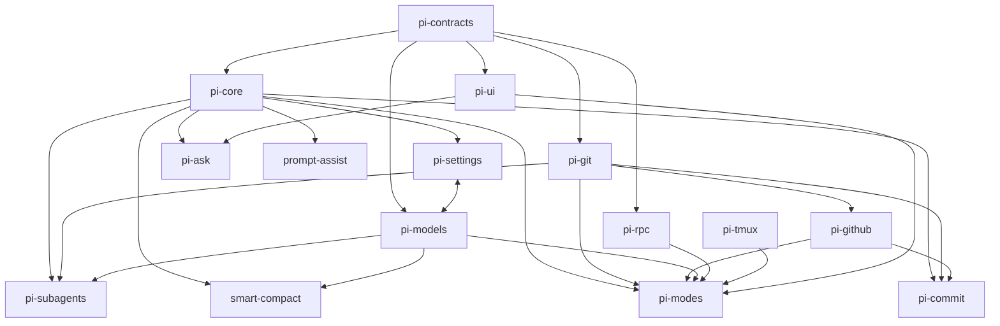
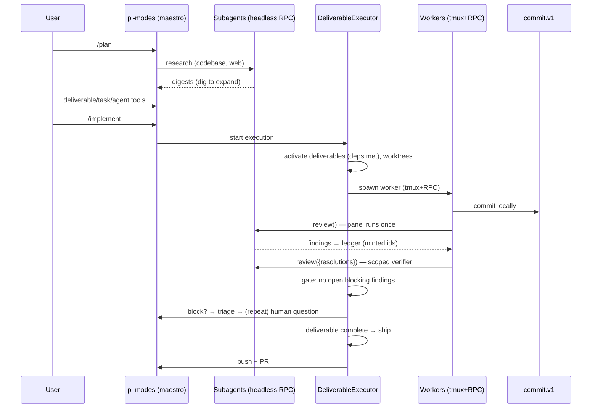

# Architecture

pi-maestro is a lockstep pi extension stack. The repo root is the pi bundle
manifest; packages under `packages/*` are either **libraries** (importable
by anyone) or **extensions** (loaded by the manifest, forbidden from value-
importing each other — `scripts/check-boundaries.mjs` enforces it).
Extensions talk only through versioned capabilities and typed events.

## Packages

The manifest loads seven extension entries:

- `@vegardx/pi-ask` — questionnaire capability and `ask` tool.
- `@vegardx/pi-prompt-assist` — ghost prompt suggestions and input assists.
- `@vegardx/pi-settings` — layered settings (also a library), the
  `/maestro` menu.
- `@vegardx/pi-subagents` — one-shot headless agents (research, review,
  verify) over the RPC transport; exposes `subagents.v1`.
- `@vegardx/pi-commit` — conventional commits + `ship.v1`.
- `@vegardx/pi-smart-compact` — work-continuity compaction: replaces pi's
  default compaction summary with a work-focused one, with safe fallback.
- `@vegardx/pi-modes` — the maestro: permission modes, plan engine and
  tools, deliverable execution, review gate, shipping, carry-forward, UI.

Libraries:

- `@vegardx/pi-contracts` — shared ids, events, capability interfaces, plan
  and model vocabulary. Depends on nothing.
- `@vegardx/pi-core` — extension wrapper, capability registry, typed
  events, feature flags.
- `@vegardx/pi-models` — profile/role-pool model resolution (see
  [models.md](models.md)).
- `@vegardx/pi-ui` — pure renderers and thin TUI component wrappers.
- `@vegardx/pi-git` / `@vegardx/pi-github` — typed git/worktree and
  `gh` seams.
- `@vegardx/pi-rpc` — the maestro⇄agent RPC protocol (wire types mirror
  modes' domain types so rpc stays dependency-light).
- `@vegardx/pi-tmux` — typed tmux client.
- `@vegardx/pi-research-tools` — websearch (Exa), webfetch, context7 tools.
  Deliberately **not** in the manifest: the maestro session must not load
  it; it's passed via `-e` to spawned research children so they get a
  deterministic tool namespace.

(`settings ⇄ models` is a deliberate type-level coupling: settings persists
profile role pools and process-local typed overrides live in contracts; models
reads layered settings and consumes those overrides.)

## Capabilities and events

Capabilities (versioned, registered at load, looked up at use):

- `subagents.v1` — spawn one-shot headless agents
- `ask.v1` / `ask-transport.v1` — questionnaire presentation and transport
- `commit.v1` / `ship.v1` — local conventional commits; push + PR
- `modes.v1` — mode state + execution status
- `prompt-assist.v1` — ghost text suggestions
- `usage.v1` — unified token/cost ledger
- `overlays.v1`, `settings.v1` — TUI overlays; settings menu integration

Events (bus, namespaced `maestro.*`): `mode.changed`, `plan.updated`,
`run.status`, `run.progress`, `run.agentEvent`, `supervisor.needDecision`,
`ship.completed`.

## Runtime flow

Workers are full pi sessions in per-deliverable worktrees — observable,
steerable, resumable. Reviewers and researchers are headless one-shot
subagents. The review gate itself is documented in
[review-loop.md](review-loop.md).

Persistent state lives under the pi agent directory:

- `<agentDir>/maestro/plans/<slug>/plan.json` — the deliverable-based plan
  (never garbage-collected automatically)
- `<agentDir>/maestro/plans/<slug>/handoffs/` — numbered `/distill` and
  `/handoff` carry documents
- Worker sessions managed via tmux (ephemeral); usage recorded in the
  unified ledger
- `<agentDir>/maestro/plans/<slug>/debug/active.json` — active structured,
  redacted debug recovery/issue-review state only; deleted on cancel, defer,
  successful post, or failed post

## Debug episode architecture

`/debug` is an episode-scoped state machine owned by `pi-modes`, not a generic
model conversation. Mechanical collectors freeze role/mode/session/plan,
worker generation, runtime versions, bounded failures, and the selected
recovery outcome. Model-authored summary/cause/fix fields are kept in a
separate structured object so a reviser cannot rewrite observed facts.

The phases are ordered and non-reentrant:

1. collect bounded facts and diagnose;
2. ask one mutually exclusive recovery question;
3. execute the selected action once through `ExecutionHandle`/`PlanEngine`;
4. mechanically record success or failure;
5. enter the issue review loop; and
6. freeze the final redacted title/body, display it, and optionally call the
   typed `@vegardx/pi-github` issue seam.

The active artifact persists outside the conversational tail, so compaction
rehydrates phase 5 without dispatching phase 3 again. Revision calls receive
only the current structured draft, frozen bounded evidence, recovery result,
and the user's instruction. They must return a complete replacement with
byte-identical mechanical provenance. Invalid or failed revisions retain the
prior draft. Revision history is bounded even though user-driven iterations
are unlimited.

The final external privacy boundary assembles all Markdown, applies
`redactSecrets()`, displays that exact value, and passes the same bytes on
stdin to `gh issue create --body-file - -R github.com/vegardx/pi-maestro`.
Recovery and posting are independent best effort: neither failure undoes the
other, and uncertain GitHub mutations are not retried silently.

Worker authority is intentionally narrower. A worker can submit a proposal
bound to its authenticated composite identity, plan fingerprint, and session
generation. The maestro validates it and exclusively owns consent, plan
repair, steering, retry/restart, workspace validation, and issue posting.
Fresh restart creates a new JSONL but reuses the one validated worktree and
branch; prior transcript paths remain history.

## Key design decisions

- **A deliverable is one branch, one PR** — the atomic unit of work,
  ordered by a `dependsOn` DAG; stacked PRs by default.
- **Maestro owns shipping** — workers only commit, never push or open PRs.
- **Workers on tmux, everything else headless** — workers need observation
  and steering; reviewers/researchers are one-shot verdict producers.
- **Flat plan tools** — `deliverable`, `task`, `agent` (no nested JSON).
- **The gate is a ledger, not a verdict** — completion requires no open
  blocking findings, with a bounded fix-cycle budget and an escalation
  ladder (worker → maestro → human).
- **Plans out-detail the executor** — tasks carry file paths and
  signatures; workers follow instructions, they don't design.
- **Direct role pools** — model-consuming paths resolve curated roles; ordered
  exact models and efforts are layered session → project → global, with the
  live session model as the final fallback. No runtime tier graph remains.
- **Core settings presentation** — `/maestro` composes pi's pinned
  `SettingsList`, `SelectList`, and `DynamicBorder`; domain-specific components
  are limited to focused target/extension multi-selects.

<!-- verified against eb4ef95ff0cf -->
